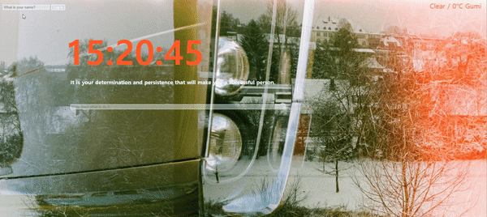

# Todolist

##### Todo list

- 로그인 기능 (사용자 이름을 설정)
- 해당 위치의 지역, 날씨, 시간을 제공
- todo list를 작성, 삭제
- 배경사진과 명언 랜덤 제공

## 🛠 Tech Stack

  

## 🗂 Structure

```bash

┌── css
│   ├── Elements.js
│   ├── Elements.module.css
│   ├── Movie.js
│   └── Movie.module.css
├── js
│   ├── background.js
│   ├── clock.js
│   ├── greetings.js
│   ├── quotes.js
│   ├── todo.js
│   └── weather.js
└── index.html


```

## API

https://api.openweathermap.org/data/2.5/weather

## 👀



https://kimkyungmin123.github.io/Todolist/
